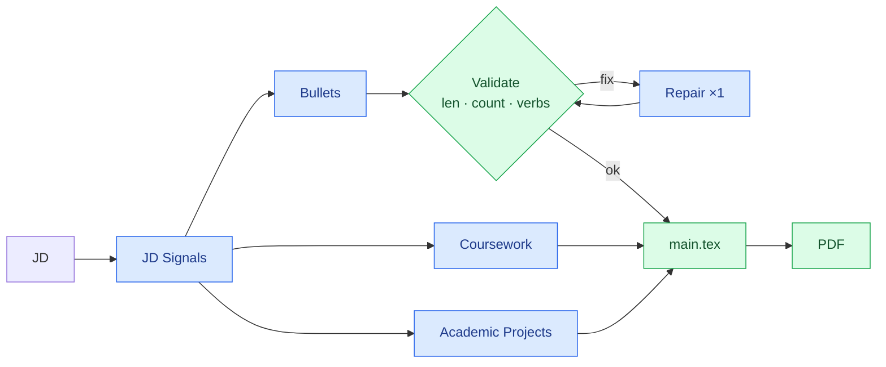

# ATS Resume Builder

AI-powered workflow that generates tailored, ATS-optimized resume bullets from a job description, selects the most relevant coursework and academic projects, then compiles a professional PDF resume. Model calls go through [LiteLLM](https://github.com/BerriAI/litellm), so any provider works; the default is `openai/gpt-5.2`.

**🔗 Live app:** https://resume-tailor-885256127561.us-central1.run.app

Hosted on Google Cloud Run; every push to `main` auto-deploys via Cloud Build.

## How It Works

### Workflow Overview

1. **JD Signal Extraction** → An LLM cleans the job description down to ranking signals (skills, responsibilities, domain, constraints).
2. **Parallel Tailoring** → From those signals, three tasks run at the same time:
   - **Bullet generation** for each work experience, grounded in project evidence.
   - **Columbia coursework selection** — picks the most JD-relevant courses.
   - **Academic project selection** — picks the most JD-relevant projects.
3. **Validation & Repair** → Generated bullets are checked in code (length, count, unique verbs) and repaired once if any check fails.
4. **Template Injection** → Bullets, coursework, and academic projects are injected into the LaTeX template (`main.tex`).
5. **PDF Compilation** → Compiled to a professional PDF via `xelatex`/`tectonic`.

### Architecture



> Blue = LLM · Green = code. `Bullets`, `Coursework`, and `Academic Projects` run in parallel from the JD signals; bullets loop through one validate → repair round before assembly.

### Key Features

- **ATS Optimization**: Reframes experience with JD keywords and terminology for maximum ATS relevance.
- **Two Generation Modes**: `sequential` (one company at a time, tracks used starting verbs across companies) or `single_prompt` (all companies in one call). Both enforce length in code with a repair round.
- **Code-Enforced Constraints**: Bullet length is checked with Python `len()` against `200 <= len(bullet) <= 240`; also validates bullet count and unique starting verbs.
- **Evidence-Based**: Stays grounded in the provided project JSON — no fabrication. Human-proofread `example_bullets` are treated as authoritative.
- **Lexical Diversity**: Varies vocabulary, avoids repetition, and spreads tool mentions across bullets.

### Generation Pipeline

**Input Format:**
- **Job description**: header+body (`company_name: X`, `position_name: Y`, `---`, then the JD text), a JSON object, or plain text.
- **Work evidence**: `data/work_<company>_<min>-<max>.json`, where the filename encodes how many bullets to generate. Each project provides:
  `problem`, `actions`, `results` (with optional `(framing variants: ...)`), `tools`, `keywords`, `example_bullets` (proofread references), and `harvested_bullets` (additional variants).
- **Academic projects**: `data/proj_academic_2-2.json` using `Topic`, `Bullet`, `Link` (selected, not regenerated).

**Generation Process:**
1. **JD Signal Extraction** — LLM distills the JD while preserving all ranking signals.
2. **Prompt Construction** — Builds system/user prompts with JD signals, project evidence, hard constraints, and tailoring instructions.
3. **LLM Call** — Via LiteLLM (default `openai/gpt-5.2`; any `vertex_ai/...` or other provider also works).
4. **Validation** — Code checks bullet count, `len(bullet)` range, and starting-verb uniqueness.
5. **Repair Loop** — On failure, sends a repair prompt containing the exact issues and regenerates once; the closest result is kept with a warning if it still misses.
6. **Output** — Bullets per company, plus selected coursework and academic projects.

**Output Format:**
- Each bullet satisfies `200 <= len(bullet) <= 240` characters.
- Unique starting action verbs per company (and across companies in `sequential` mode).
- Measurable impact placed at the end when available.

## Project Structure

```
.
├── main_code/                      # Application source code
│   ├── resume_bullet_workflow.py   # Core generation, selection, validation/repair
│   ├── workflow_prompts.py         # System/user prompt builders
│   ├── build_resume.py             # End-to-end pipeline (bullets → TeX → PDF)
│   └── app.py                      # Streamlit UI
├── data/                           # Input files
│   ├── JD.txt                      # Job description (header+body, JSON, or plain text)
│   ├── main.tex                    # LaTeX resume template
│   ├── work_*.json                 # Work experience evidence files
│   └── proj_academic_2-2.json      # Academic project pool
├── output/                         # Generated artifacts (.tex, .pdf, prompt_logs/)
├── reference_resume/               # Reference PDFs
├── run.sh                          # One-command launcher (loads .env, starts UI)
├── .env                            # Local secrets/config (gitignored)
├── Dockerfile                      # Container build (TeX + fonts) for deployment
└── .streamlit/                     # Streamlit config
```

## Quick Start

### Setup

Create a `.env` file in the repo root:

```bash
# Default provider is OpenAI
OPENAI_API_KEY=sk-...

# Optional: to use Vertex/Gemini models instead, set these and pick a vertex_ai/... model
# VERTEXAI_PROJECT=your-project
# VERTEXAI_LOCATION=global   # defaults to "global" in code
```

Then install dependencies:

```bash
uv sync
```

### Run the UI (simplest)

```bash
./run.sh
```

`run.sh` loads `.env`, activates the virtualenv, and launches Streamlit at http://localhost:8501. In the sidebar you can pick the model from a dropdown (OpenAI/Vertex presets, or type a custom LiteLLM name) and choose the generation mode. Set `APP_PASSWORD` in `.env` to require a password on the app.

### Run from the CLI

```bash
# Generate bullets for one company
uv run resume-bullets --jd data/JD.txt --project-file data/work_agoda_2-2.json

# Generate bullets for all companies (sequential mode)
uv run resume-bullets --jd data/JD.txt --all --generation-mode sequential

# Full pipeline (bullets → TeX → PDF)
uv run build-resume --jd data/JD.txt --generation-mode sequential --log-prompts
```

## Configuration

- **Model**: Defaults to `openai/gpt-5.2` (configurable via `--model`, `LITELLM_MODEL`, or the UI dropdown). Requires the matching provider key (`OPENAI_API_KEY`, or `VERTEXAI_PROJECT` for `vertex_ai/...`).
- **Generation Mode**: `sequential` by default (`single_prompt` also available); both validate length in code.
- **Bullet Length**: `200 <= len(bullet) <= 240` characters (hard constraint).
- **Max Repair Attempts**: 1 repair round per mode.
- **Output Directory**: `output/` (configurable via `--output-dir`).
